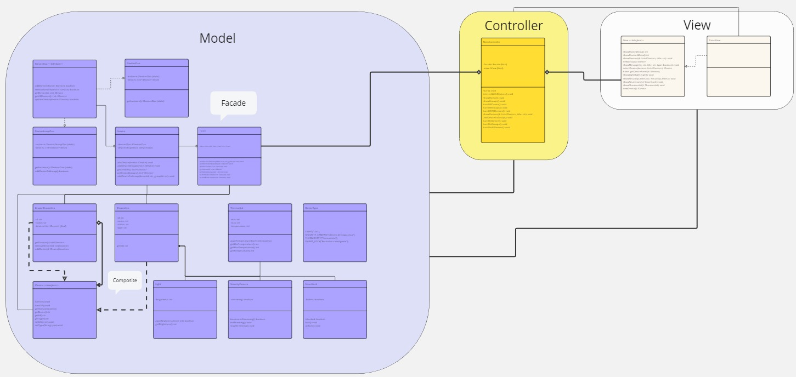
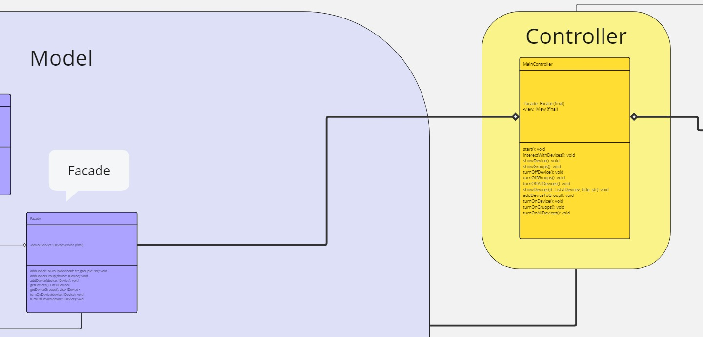
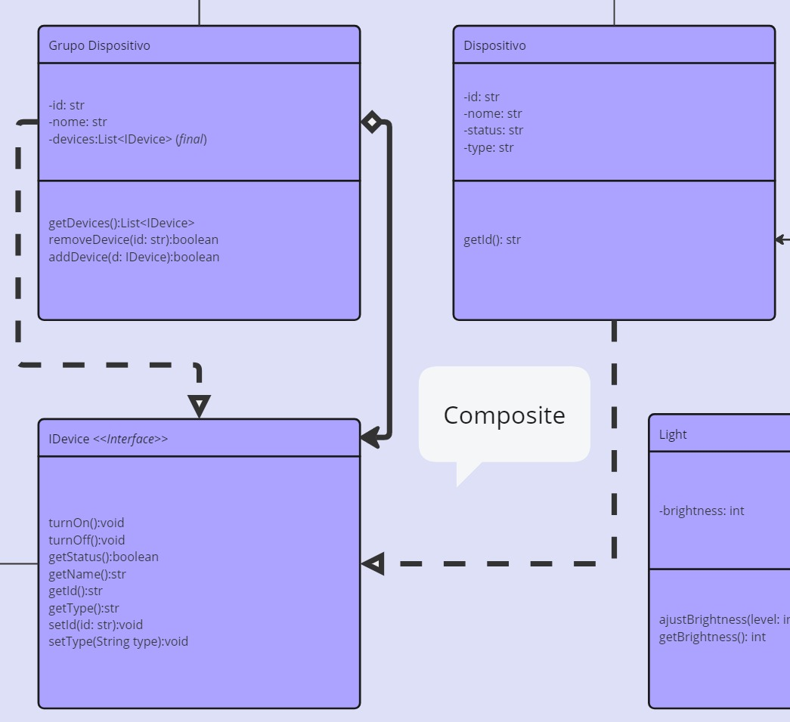
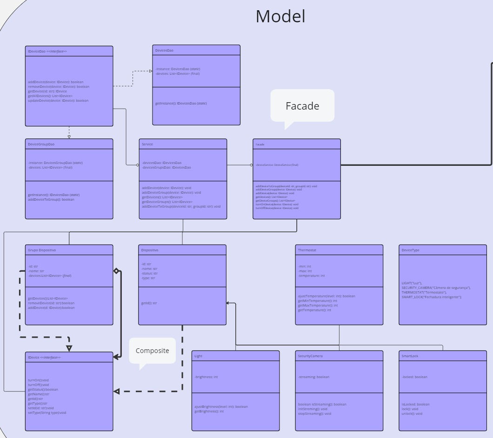

# SmartHome

Feito por: 
- [Igor Filipi Cardoso](https://github.com/igorcardosoy)

#### Sistema simples de gerenciamento de dispositivos inteligentes, permitindo ligar e desligar eles.

O padrão Composite nos permitiu modelar uma hierarquia de dispositivos, onde grupos de dispositivos podem ser tratados como um único elemento. Isso significa que uma ação, como desligar, pode ser aplicada tanto a um dispositivo individual quanto a um grupo inteiro, proporcionando uma maior flexibilidade e simplificando a lógica de controle.

O padrão Facade, por sua vez, atuou como uma interface unificada para o sistema, encapsulando a complexidade do modelo e oferecendo um conjunto de métodos simplificados para interagir com os dispositivos. Embora limite levemente as possibilidades de personalização, o Facade garante uma maior coesão e facilita a compreensão do sistema por outros desenvolvedores.

  
  
  
  

